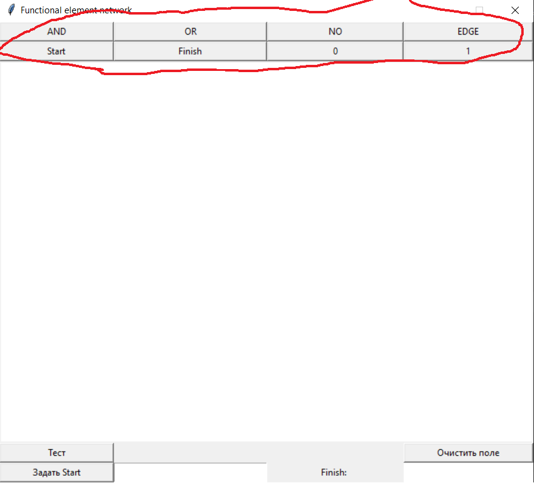
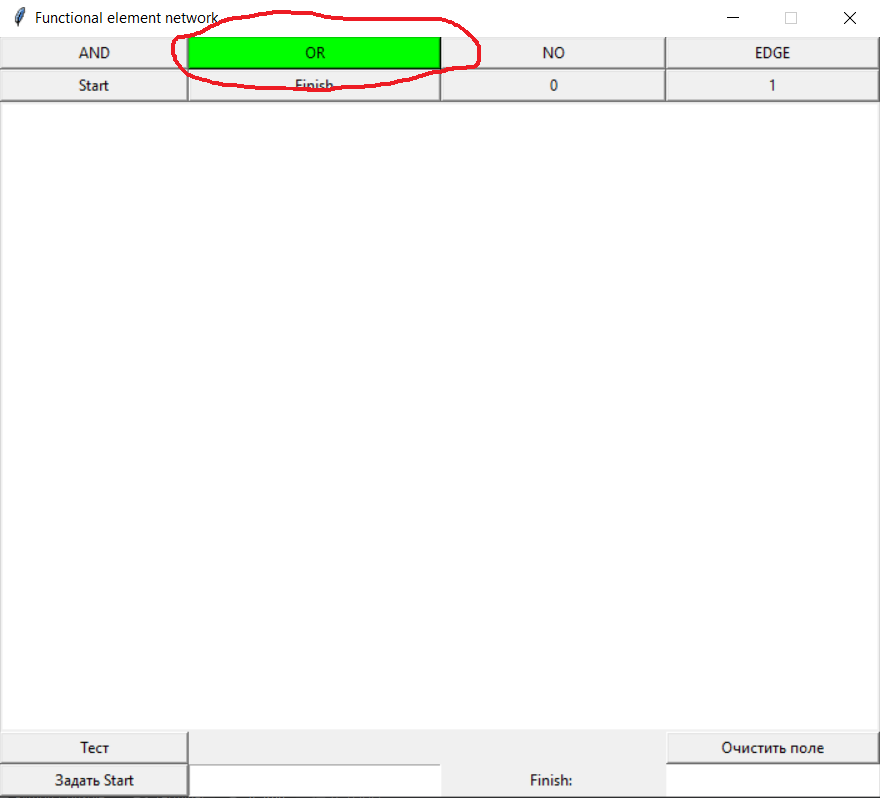
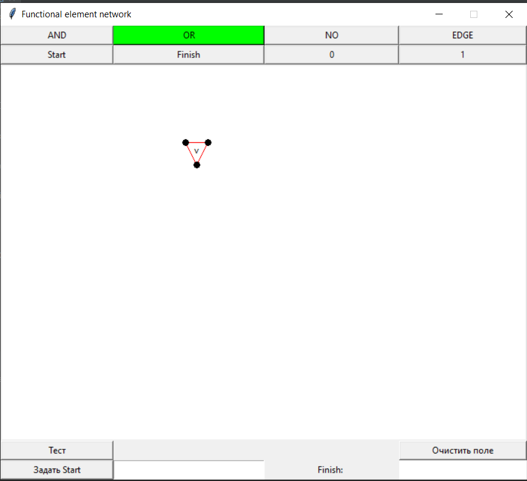
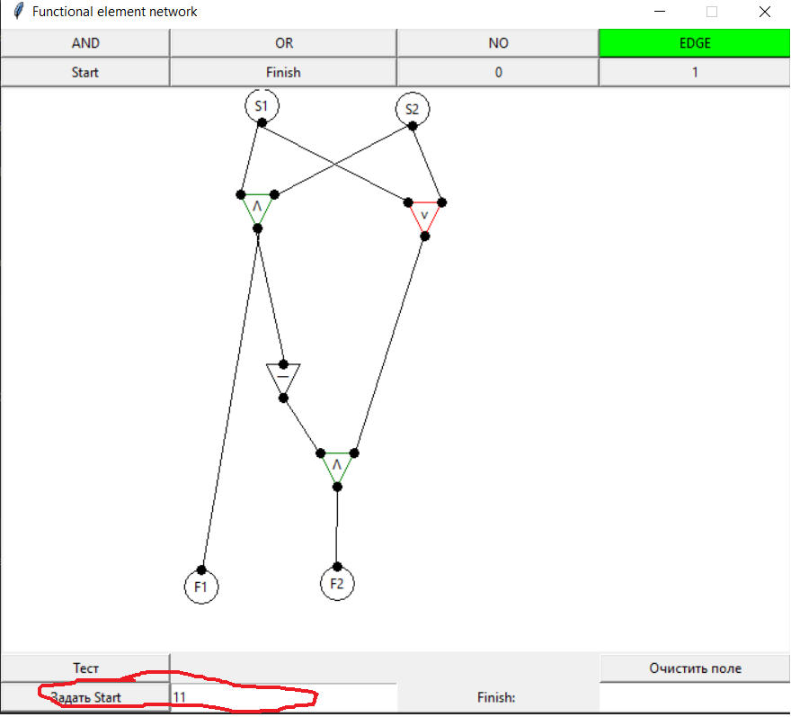
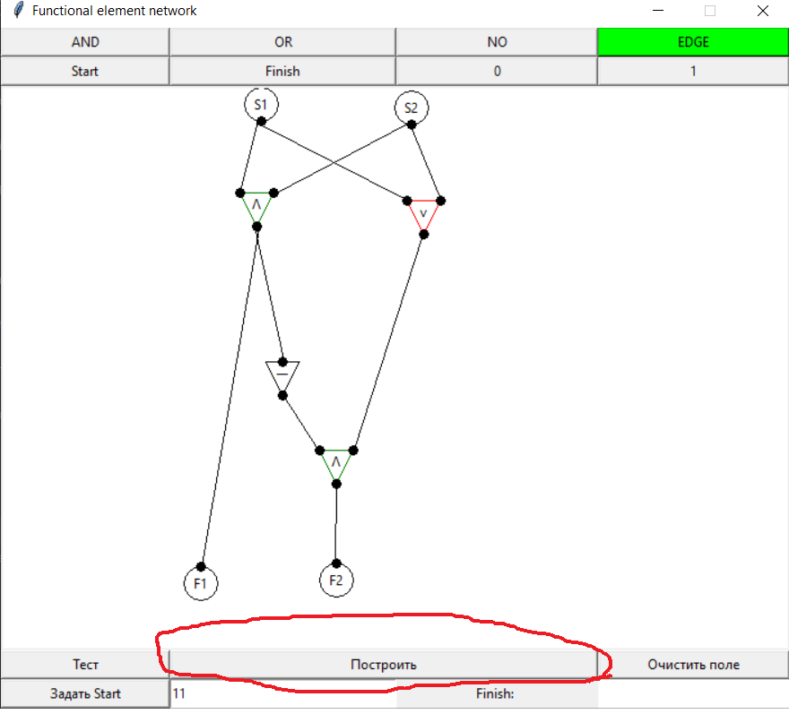
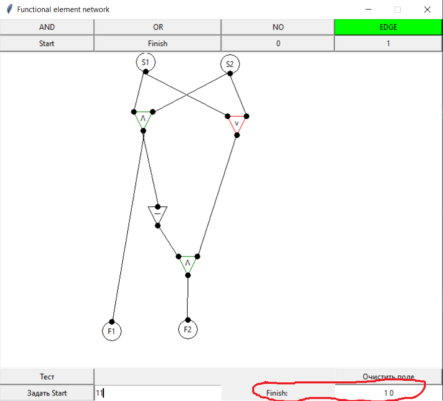

Программа для графического построения сетей из функциональных элементов.

Как работать с программой:

1) Нарисуйте СФЭ:

После запуска в верхней части экрана появится выбор - какой элемент нарисовать:

при нажатии на одну из 8 кнопок она выделяется зеленым

нажатие на экран рисует выбранный(подсвеченный зеленым) элемент

2)Вычисление значений:

Когда вы нарисовали СФЭ(на рисунке сумматор 2х бит) в левом нижнем углу задайте значения входных переменных(в соответсвии с их нумерацией в СФЭ) и нажмите "задать Start"

после чего появится кнопка "построить"

при нажатии на нее в правом нижнем поле появится результат работы(или сообщение об ошибке, если посчитать финальные состояния нельзя)

