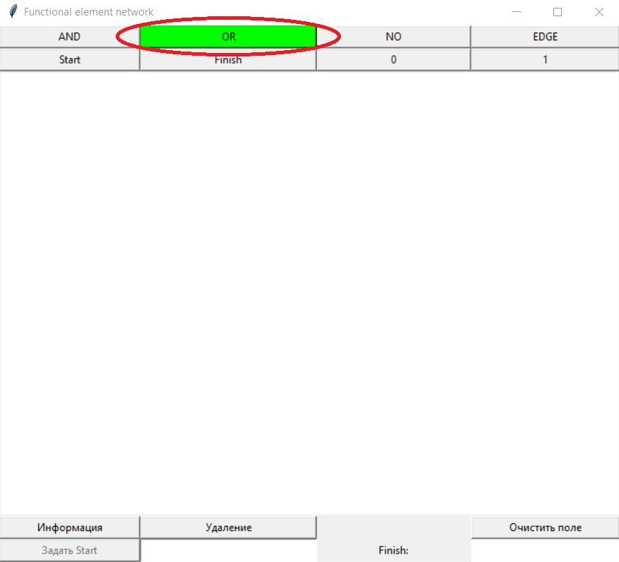
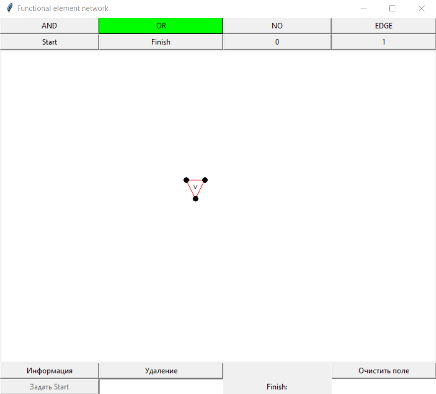
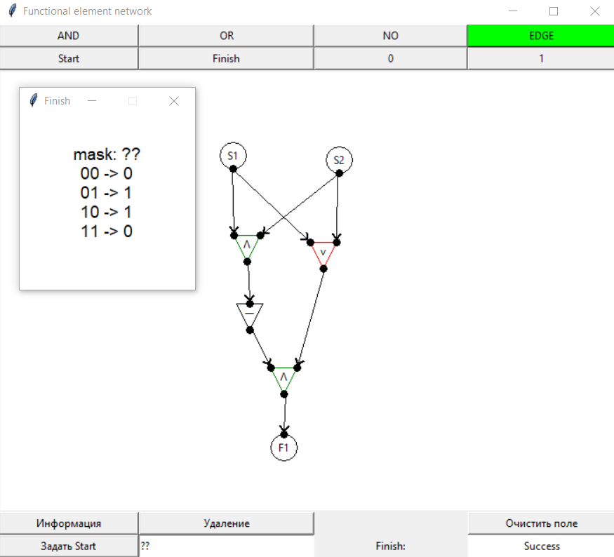

Программа для графического построения сетей из функциональных элементов.

Как работать с программой:

1)Нарисуйте СФЭ:

После запуска в верхней части экрана появится выбор - какой элемент нарисовать:

При нажатии на одну из 8 кнопок она выделяется зеленым

Нажатие на экран рисует выбранный(подсвеченный зеленым) элемент

Если какой-то элемент СФЭ надо удалить:

Нажмите "Удалить"

Она загорится зеленым и на СФЭ появятся красные точки

При нажатии на точку на элементе он удаляется.

2)Вычисление значений:

Когда вы нарисовали СФЭ(на рисунке XOR) в левом нижнем углу задайте значения входных переменных(в соответсвии с их нумерацией в СФЭ) и нажмите "задать Start". Помимо значений можно передавать битовую маску заменяя какие - то входы знаком "?", тогда алгоритм выдаст результат для каждого возможного значения

или

Если кнопка "задать Start" не активна, проверьте СФЭ, в нем есть элементы, которые посчитать невозможно(присутствует цикл или не все входы в элемент использованы)

После чего появится кнопка "Посчитать"

При нажатии на нее в правом нижнем поле появится результат работы(или сообщение об ошибке, если посчитать финальные состояния нельзя). Если вы передали не значения а маску, то появится новое окно со списком значений и результатом работы на каждом

или

